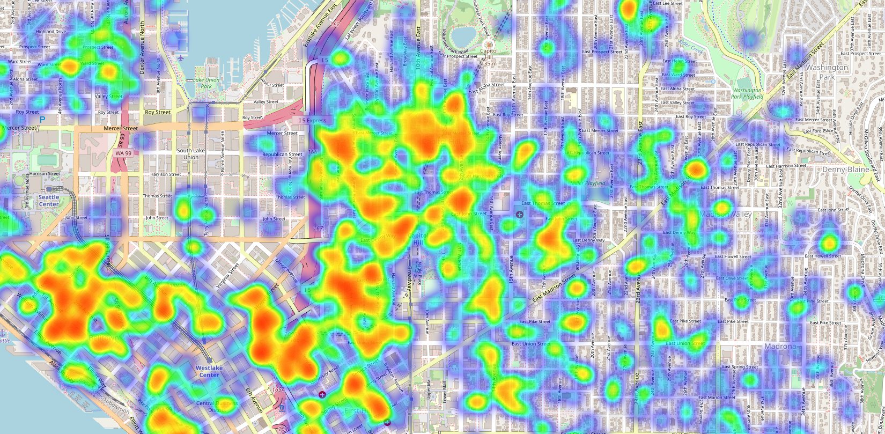
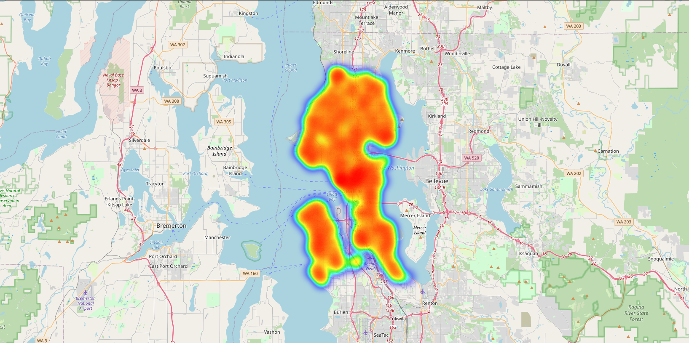
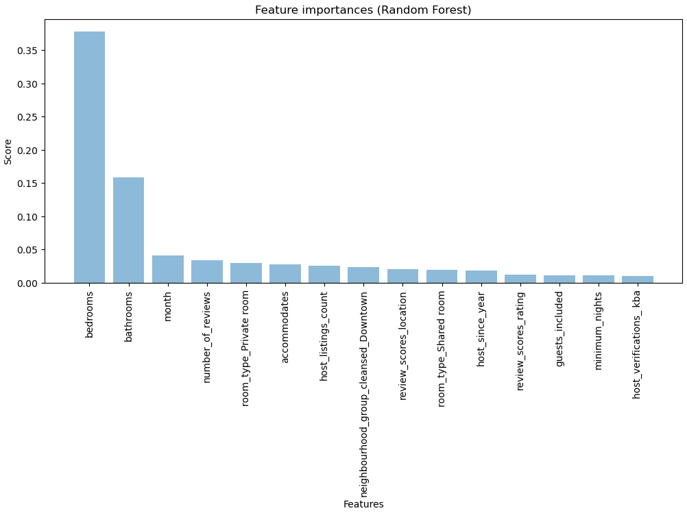

# Cross-Industry Standard Process for Data Mining in Seattle Airbnb

# Description
Using CRISP-DM to analyze Airbnb data sets. The dataset contains accommodations that took place in the year 2008 in Seattle, WA. We will answer some questions that will bring insight to the business and platform users.

Article on medium: [Medium](https://medium.com/@vagner.belfort/applying-crisp-dm-to-an-airbnb-dataset-4a04f0e4b28b)

# Seattle Airbnb Analysis
Since 2008, guests and hosts have used Airbnb to travel in a more unique, personalized way. As part of the Airbnb Inside initiative, this dataset describes the listing activity of homestays in Seattle, WA.

6 steps of CRISP-DM (Cross-Industry Standard Process for Data Mining):
1. Business Understanding
1. Data Understanding
1. Data Preparation
1. Modelling
1. Evaluation
1. Deployment

## Business Understanding
Since 2008, guests and hosts have used Airbnb to travel in a more unique, personalized way. As part of the Airbnb Inside initiative, this dataset describes the listing activity of homestays in Seattle, WA.

In this project, we will use the datasets available on Kaggle: https://www.kaggle.com/datasets/airbnb/seattle 

Let's answer 3 business questions:

- Where is the busiest in Seattle?
- What is the distribution of properties in the city limits?
- What are the main factors that affect booking prices?.

## Resources used in development:
 - matplotlib==3.6.2
 - seaborn==0.12.2
 - pandas==1.5.2
 - numpy==1.25.1
 - scikit-learn==1.2.0
 - folium==0.14.0
 - jupyterlab==3.5.2

## Conclusion

### Question 1: 

Top 5 areas which have the highest number of Airbnb properties in Seattle are: 98122, 98103, 98102, 98105, 98109. They all in the center of Seattle and near Lake Washington where has the most convenient transportation.

### Question 2:
 
 
We can clearly see that most of the listings are concetrated in central areas (Broadway) and Belltown.

### Question 3: 

 - The modelling also shows us that factors already mentioned above have influence on price: time of the year, location, number of bedrooms, bathrooms, beds and accomodates;
 - The host qualities are important: number of host’s listings, number of years since being the host, time in which the host responds to the inquiries;
 - The pricing might depend on reviews: number of reviews and review scores.

## Acknowledgement

 - https://towardsdatascience.com/crisp-dm-methodology-for-your-first-data-science-project-769f35e0346c
  - https://towardsdatascience.com/data-101s-spatial-visualizations-and-analysis-in-python-with-folium-39730da2adf
